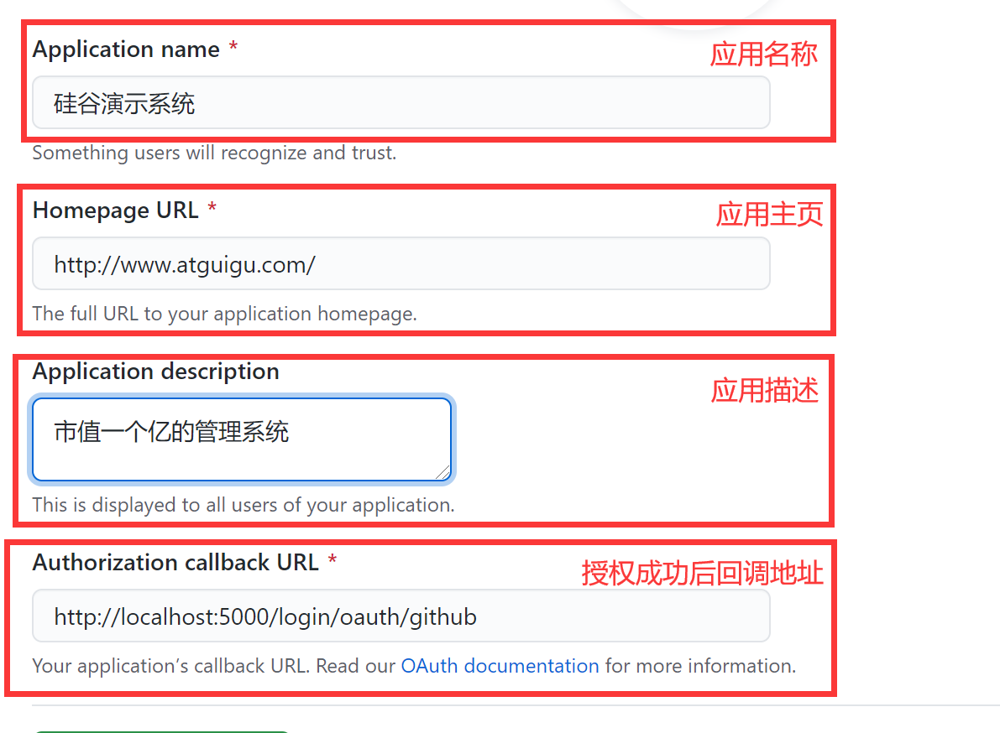
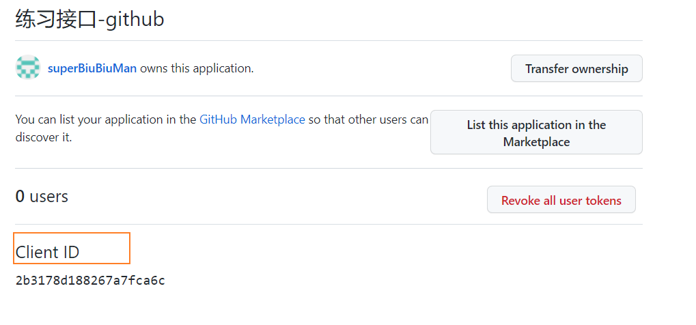

## 移动端Vue适配小练习

* 为了练习,就没有使用自动转换rem的功能,想了解的可以看看这几位博主的
  * [博主1](https://www.jianshu.com/p/67a29794b98b)
  * [博主2](https://blog.csdn.net/weixin_35773751/article/details/120894238)
* 想看源码的可以到github上下载(后台也打包好了)
  * https://github.com/superBiuBiuMan/vue_mobile_littel_demo
  * 

### 项目遇到的问题记录

#### Navigation aborted from “/center“ to “/login“ via a navigation guard

**解决方法:**

vue_project\src\router\index.js 路由主入口文件当中添加如下代码

```javascript

const originalPush = VueRouter.prototype.push
//解决重复提交相同链接报错
VueRouter.prototype.push = function push(location, onResolve, onReject) {
    if (onResolve || onReject)
        return originalPush.call(this, location, onResolve, onReject)
    return originalPush.call(this, location).catch((err) => {
        if (VueRouter.isNavigationFailure(err)) {
            // resolve err
            return err
        }
        // rethrow error
        return Promise.reject(err)
    })
}
const originalReplace = VueRouter.prototype.replace
VueRouter.prototype.replace = function replace(location, onResolve, onReject) {
    if (onResolve || onReject){
        //回调函数里面会用到this的指向,所以就要使用call
        return originalReplace.call(this, location, onResolve, onReject)
    }
    return originalReplace.call(this, location).catch((err) => {
        if (VueRouter.isNavigationFailure(err)) {
            //如果为相同链接引发的错误,返回错误原因,promise状态为resolve
            // resolve err
            return err
        }
        // rethrow error
        return Promise.reject(err)
    })
}
```

#### 配置代理问题

由于视频的是react,所以配置代理花了一点时间

在`vue.config.js`当中,主要是proxy的配置

```javascript
const { defineConfig } = require('@vue/cli-service')
module.exports = defineConfig({
  lintOnSave:false,
  transpileDependencies: true,
  devServer:{
    proxy:{
      "/dev":{
        //转发
        target:"http://localhost:5000",
        changeOrigin:true,
        //重写,删除/dev前缀
        pathRewrite:{
          "^/dev":"",
        }
      }
    }
  }
})

```

注意:这样子写的话所有api请求都需要戴上/dev前缀了,所以一般都是对axios进行二次封装,下面是我的二次封装

```javascript
import axios from "axios";
import nprogress from "nprogress"
import "nprogress/nprogress.css"

//创建一个axios的实例化对象
//传入配置对象
const service = axios.create({
    //每一个ajax请求都添加/dev前缀
    //比如http://localhost:8080/dev/login
    //http://localhost:8080/dev/home
    baseURL:"/dev",
    //请求超时时间
    timeout: 2000
});
//请求拦截器
service.interceptors.request.use((config) => {
    //进度显示(当然,nprogress是假进度条)
    nprogress.start();
    return config;
})

//响应拦截器
service.interceptors.response.use((response) => {
    nprogress.done();
    return response.data || response;
}, (error) => {
    nprogress.done();
    console.log("未知错误!");
    return new Promise(() => {});
})

export default service;
```

### OAuth认证

#### OAuth2.0

- OAuth 2.0 是目前最流行的授权机制，用来授权第三方应用，获取用户数据。
- 简单说，OAuth 就是一种授权机制。数据的所有者同意其他应用使用自己存储的用户信息。

#### 授权流程（以GitHub为例）

* [GitHub官方文档](https://docs.github.com/cn/developers/apps/building-oauth-apps/creating-an-oauth-app)
* 开发流程介绍

  - 从A 网站跳转到 GitHub授权页面。
  - GitHub 要求校验用户信息，引导用户登录。
  - GitHub 询问"A 网站要求获得你的xx数据，你是否同意？"
  - 用户同意，GitHub 就会重定向到A网站对应的服务器，同时发回一个授权码。
  - A网站服务器使用授权码，向 GitHub 请求令牌。
  - GitHub 返回令牌token. A网站服务器使用令牌，向 GitHub 请求用户数据。
* 应用登记

  - 一个应用要 OAuth 授权，必须先到对方网站登记，让对方知道是谁在请求。

#### 使用GitHub授权

##### 1.GitHub登记应用

登记地址：https://github.com/settings/applications/new



##### 2.获得client_id

查看地址：https://github.com/settings/developers



##### 3.获得Client secrets


##### 4.配置

4.1 前台项目准备好个人中心组件,供授权成功后查看

4.2 将得到的 client_id 、clinet_secret配置到服务器config\index.js中，随后重启服务器。

```javascript
// github oauth
const CLIENT_ID = "xxxxxxxxxxxxxxx";
const CLIENT_SECRET = "xxxxxxxxxxxxxxx";
```


4.3 配置前端请求地址,这里就不写了

4.4 项目中携带网站标识跳转到授权页

```javascript
loginGithub = ()=>{
    window.location.href = AUTH_BASE_URL+'?client_id='+CLIENT_ID
}
```


### 项目启动

#### 1.电脑安装好MongoDB后启动

#### 2.server路径下cmd打开,输入npm start


#### 3.项目启动 ,项目路径下cmd打开,输入npm run serve后浏览器进入~


### 项目的展示

**主页登录**


**获取验证码**


**个人中心**


**github关联**


关联后

