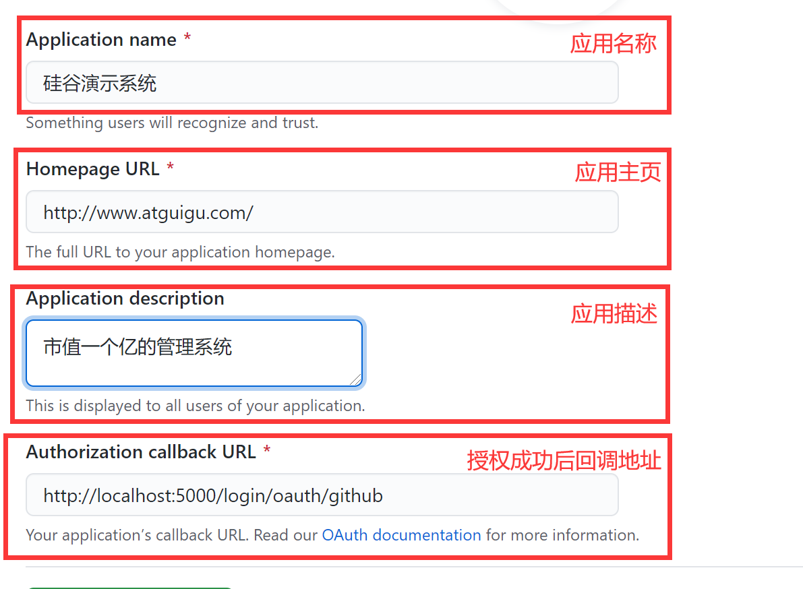
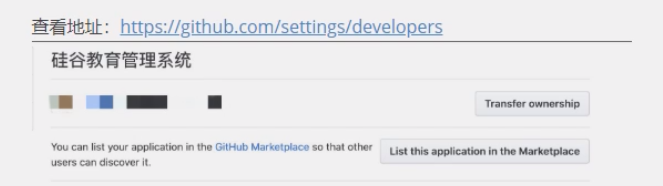

## 1.OAuth 2.0

- OAuth 2.0 是目前最流行的授权机制，用来授权第三方应用，获取用户数据。
- 简单说，OAuth 就是一种授权机制。数据的所有者同意其他应用使用自己存储的用户信息。


## 2. 授权流程（以GitHub为例）

- 开发流程介绍

  - 从A 网站跳转到 GitHub授权页面。
  - GitHub 要求校验用户信息，引导用户登录。
  - GitHub 询问"A 网站要求获得你的xx数据，你是否同意？"
  - 用户同意，GitHub 就会重定向到A网站对应的服务器，同时发回一个授权码。
  - A网站服务器使用授权码，向 GitHub 请求令牌。
  - GitHub 返回令牌token. A网站服务器使用令牌，向 GitHub 请求用户数据。

- 应用登记

  - 一个应用要 OAuth 授权，必须先到对方网站登记，让对方知道是谁在请求。
  
- Github OAuth 2.0 文档
  - https://developer.github.com/apps/building-oauth-apps/authorizing-oauth-apps/

## 3.使用GitHub授权

#### 1.GitHub登记应用

​	登记地址：https://github.com/settings/applications/new
 

#### 2.获得client_id

查看地址：https://github.com/settings/developers


#### 3.配置

3.1 前台项目准备好个人中心组件,供授权成功后查看

3.2 将得到的 client_id 、clinet_secret配置到服务器config\index.js中，随后重启服务器。

```js
// github oauth
const CLIENT_ID = "xxxxxxxxxxxxxxx";
const CLIENT_SECRET = "xxxxxxxxxxxxxxx";
```

3.3 将得到的 client_id 存到前端项目 config\oauth.js 中

```js
// github申请成功后得到的client_id
const client_id = "xxxx";
// oauth验证网址
const auth_url = "https://github.com/login/oauth/authorize";

export { client_id, auth_url };
```

3.4  项目中携带网站标识跳转到授权页

```js
loginGithub = ()=>{
    window.location.href = AUTH_BASE_URL+'?client_id='+CLIENT_ID
}
```

